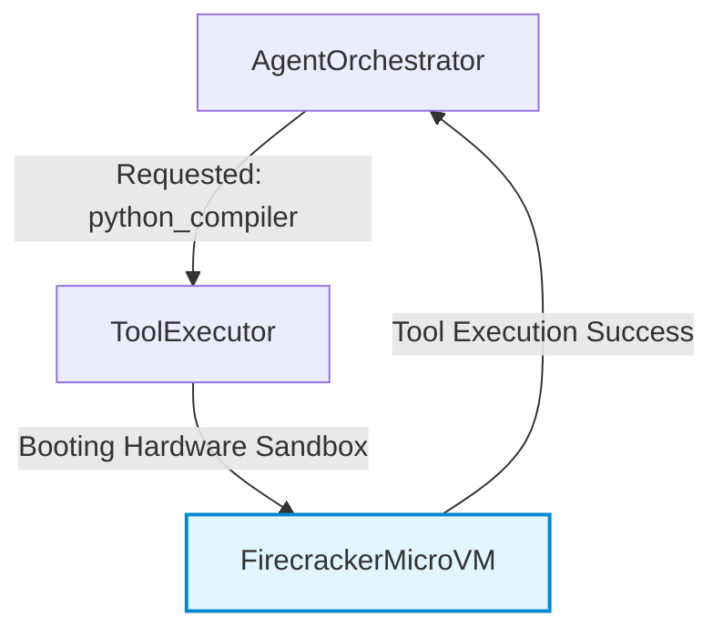

### EuroClaw Agent Execution Trace
**Task ID:** `57717d57`

```mermaid
graph TD;
    classDef secure fill:#e1f5fe,stroke:#0288d1,stroke-width:2px;
    classDef danger fill:#ffebee,stroke:#d32f2f,stroke-width:2px;
    AgentOrchestrator -->|Requested: python_compiler| ToolExecutor;
    ToolExecutor -->|Booting Hardware Sandbox| FirecrackerMicroVM;
    class FirecrackerMicroVM secure;
    FirecrackerMicroVM -->|Tool Execution Success| AgentOrchestrator;
```
